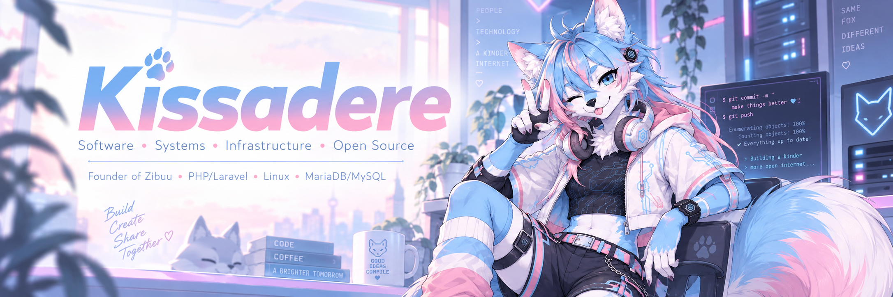
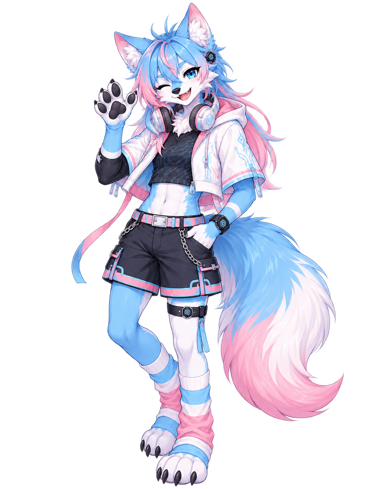

<p align="center">
  
</p>

<h1 align="center">Hi! I'm Christopher 👋</h1>

<p align="center">
  <strong>Systems · Backend Development · Infrastructure · Open Source</strong>
</p>

<p align="center">
  🇲🇽 Mexico &nbsp;•&nbsp;
  🐧 Linux enthusiast &nbsp;•&nbsp;
  💻 Software developer &nbsp;•&nbsp;
  🐾 Founder of <a href="https://zibuu.net/">Zibuu</a>
</p>

---

## About me

I'm **Christopher**, although around the internet you'll usually find me as
**Kissadere**.

I'm a systems and software enthusiast from Mexico with a somewhat unusual
background: I originally studied **Law and Criminalistics**, and eventually
found my way into systems administration, software engineering, Linux,
networking, infrastructure and backend development.

Today, most of my work revolves around building software and understanding
the infrastructure behind it.

I enjoy working with backend applications, Linux servers, databases,
networks, APIs, authentication systems, virtualization, self-hosted services
and automation.

But what interests me the most is understanding **how everything connects**.

Not only writing an application, but also understanding where it runs, how
services communicate, how users authenticate, how data is stored, how the
system is secured, how it is monitored, and what happens when something
inevitably breaks.

Sometimes everything works.

Sometimes it's DNS.

<p align="center">
  
</p>

---

## My philosophy about software

I like building software around **real problems**.

Instead of starting with:

> What features can I add?

I prefer asking:

> What problem are we actually trying to solve?

Good software doesn't need to be unnecessarily complicated.

It should be understandable, maintainable, useful and designed around the
people who actually use it.

### Open source matters to me

A significant part of what I know today came from open-source software,
documentation, communities and developers who decided to share their work.

Being able to inspect source code, experiment with projects, break things,
fix them and learn from other developers played an important role in the way
I learned technology.

Because of that, I like publishing much of my own work as **open source**,
usually under permissive licenses such as MIT.

It's my way of contributing something back to the ecosystem that helped me
learn.

### Build for real needs

I prefer software that solves an actual problem over software that exists
only to accumulate features.

Every abstraction, dependency and service should have a reason to exist.

Sometimes the best architecture is not the most sophisticated one.

It's the one that solves the problem reliably while remaining understandable
six months later.

### Security by design

Security shouldn't be something added after an application is finished.

Authentication, permissions, network boundaries, data handling, backups and
monitoring should be considered while the system is being designed.

### Maintainability over unnecessary complexity

I enjoy experimenting with new technologies, but I don't believe that using
more technologies automatically makes a project better.

If PHP, Laravel and MariaDB solve the problem correctly, I don't need five
microservices and three message brokers just because they look impressive on
an architecture diagram.

I tend to prefer simple, understandable systems and backend-first solutions,
keeping unnecessary frontend complexity to a minimum.

### Learn by building

I learn best by experimenting.

Build something.

Break it.

Figure out why it broke.

Fix it.

Understand it.

Then build something slightly more complicated.

---

## Zibuu

<p align="center">
  
</p>

<p align="center">
  <strong>Inclusive, creative, and secure technology.</strong>
</p>

I'm the founder of **[Zibuu](https://zibuu.net/)**, a personal technology
project where I combine software development, infrastructure, cybersecurity,
gaming communities and open-source experimentation.

Zibuu is also where I allow technology to have a little more personality.

Software doesn't always need to look sterile or excessively corporate.

I like mixing serious technical projects with pastel colors, gaming, anime,
furry culture, questionable humor and cute things.

That's also how **Zulu** became part of the project.

Zulu is Zibuu's anthro fox mascot: playful, tech-savvy, slightly chaotic and
usually somewhere around code, servers or infrastructure.

---

## Tech stack

### Backend development

<p>
  
</p>

My main development stack is:

- **PHP**
- **Laravel**
- REST APIs
- Backend architecture
- Authentication and authorization
- Integrations with third-party APIs
- Server-rendered web applications

PHP is the programming language where I feel most at home, and Laravel is at
the center of many of the applications and tools I build.

---

## Databases

<p>
  
</p>

The database technologies I know most deeply are:

- **MariaDB**
- **MySQL**

I work with relational database design, queries, indexing, permissions,
backups and application integration.

I'm also currently learning and experimenting with:

- PostgreSQL
- Redis

I have worked with both, but I'm still expanding my knowledge before
considering them part of my main stack.

---

## Linux, Systems & Infrastructure

<p>
  
</p>

A significant part of my work happens outside the application itself.

I regularly work with technologies and systems such as:

`Linux` · `Ubuntu` · `Debian` · `Docker` · `Nginx` · `Apache`

`Proxmox` · `KVM` · `Git` · `GitHub`

`Active Directory` · `DNS` · `WireGuard` · `OpenVPN`

`Wazuh` · `Keycloak` · `Fail2ban`

`Postfix` · `Dovecot`

I'm especially interested in the intersection between **software development
and infrastructure**.

Knowing how to deploy, secure, monitor and troubleshoot an application is just
as interesting to me as writing the application itself.

---

## Programming & scripting

Besides PHP, I've also worked with or experimented with:

### Python

I use Python for scripting, automation and projects where its ecosystem makes
it a good fit.

### Bash

Shell scripting is an important part of the way I automate Linux systems and
administration tasks.

### Rust

I'm currently learning Rust and exploring where systems programming can
complement the kind of software and infrastructure I normally build.

I'm particularly interested in using it for tools where performance,
portability or lower-level control actually provides a meaningful advantage.

---

## Currently learning

Technology never really stops moving, so neither does my learning list.

Right now I'm particularly interested in:

- Rust
- PostgreSQL
- Redis
- Backend architecture
- Distributed systems
- Linux infrastructure
- DevOps
- Cybersecurity
- APIs and integrations
- Authentication and identity systems
- Automation
- Self-hosted infrastructure

---

## Languages

🇲🇽 **Spanish** — Native

🇬🇧 **English** — CEFR **C1 Certified**

I also enjoy learning about other languages, countries and cultures, even if
it's just enough to understand some of the basics.

---

## Things I enjoy

When I'm not working on code or staring suspiciously at server logs, I enjoy:

- 🐈 Cats and animals in general
- 🎮 Video games
- 🌸 Anime
- 🐾 Furry communities and art
- 🎵 Music from around the world
- 🐧 Linux and self-hosting
- 🖥️ Computers and electronics
- 🔐 Cybersecurity
- 🌐 Networking
- 🧪 Experimenting with new technologies
- 📚 Falling into completely unnecessary technical rabbit holes
- 🔥 Building infrastructure complicated enough to create future problems for myself

---

## Open Source

Open source is one of the most important parts of my development philosophy.

Whenever it makes sense, I like making my personal projects available for
other people to:

- use,
- self-host,
- study,
- modify,
- improve,
- or simply learn from.

A lot of my work revolves around tools for:

- Minecraft communities
- Azuriom
- Web platforms
- Automation
- Infrastructure
- APIs and integrations

Some of the projects I've worked on include:

**SkinSystem** · **Marketplace** · **Vouchers** · **ReachUs** · **Seeker** ·
**Ronove**

You can find my projects here on GitHub or at:

<p align="center">
  <a href="https://zibuu.net/projects">
    
  </a>
</p>

---

## A few principles I try to follow

```text
Solve the problem first.

Understand the system you're building.

Don't introduce complexity without a reason.

Security is part of the architecture.

Readable code is better than clever code.

Automate repetitive work.

Documentation is part of the project.

Learn how things work underneath the abstraction.

Open source what you can.

And always have backups.
```

---

## Find me

<p align="center">

  <a href="https://zibuu.net/">
    
  </a>

  <a href="https://github.com/Kissadere">
    
  </a>

</p>

---

<p align="center">
  <i>Build useful things. Understand how they work. Share what you learn.</i>
</p>

<p align="center">
  🐾
</p>
